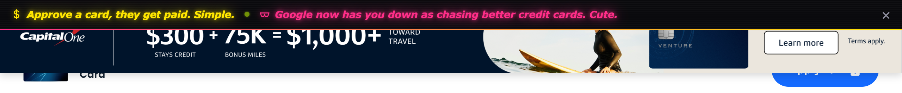
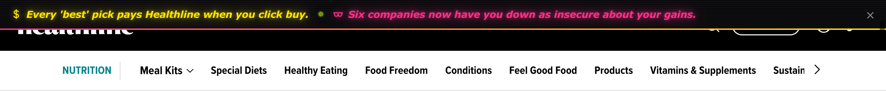
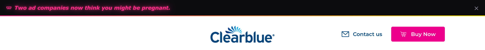
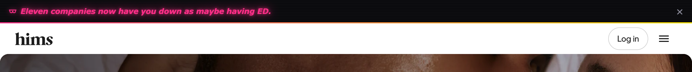

# tells

**What if the web was brutally honest about its vested interests?**

Every page you read is selling something or watching you, and usually both. They make it hard to see. tells says it out loud, in one line across the top of the page.






## What it does

- **$ Finds whose interests you're serving.** Who gets paid if you believe this page: the affiliate commissions, the sponsor, the seller reviewing itself.
- **🕶 Tells you who's watching.** Which companies just got your visit, and what that means about you on *this* page.
- **No bullshit.** Plain, brutal language. Nothing made up: if it can't point to it, it doesn't say it. When there's nothing to say, it stays quiet.

Click either half to see the receipts.

## Install (Mac, Chrome)

Paste this into Terminal:

```sh
curl -fsSL https://raw.githubusercontent.com/kateleext/tells/master/install.sh | sh
```

It asks for two keys, an [Anthropic key](https://console.anthropic.com/settings/keys) and a [TypeSafe key](https://typesafe.ai), which never leave your computer. Then it walks you through turning tells on. Arc, Edge and Dia work too.

Try it on a pregnancy test page, a "best credit cards" list, or a "best protein powder" roundup.

#punksoftware
